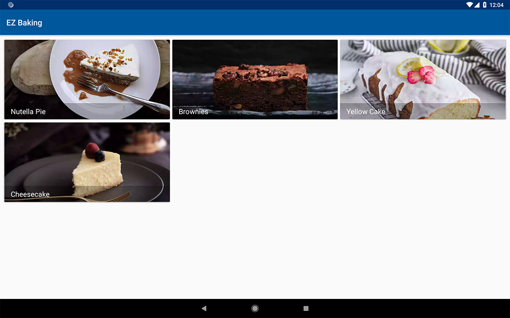
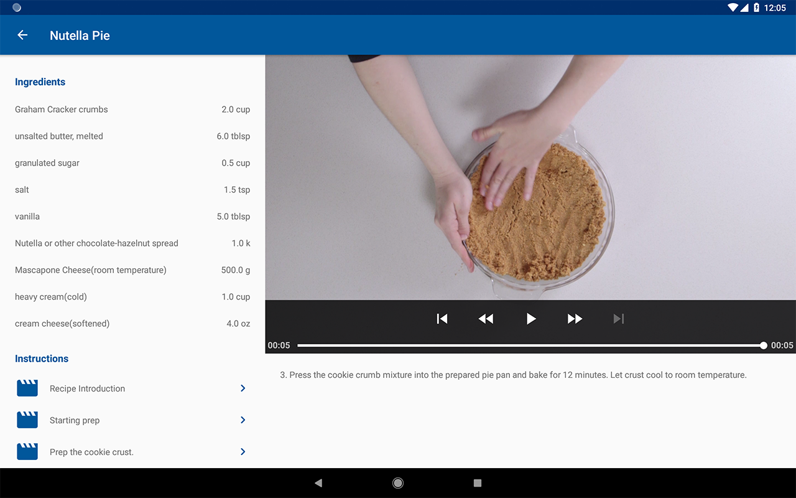
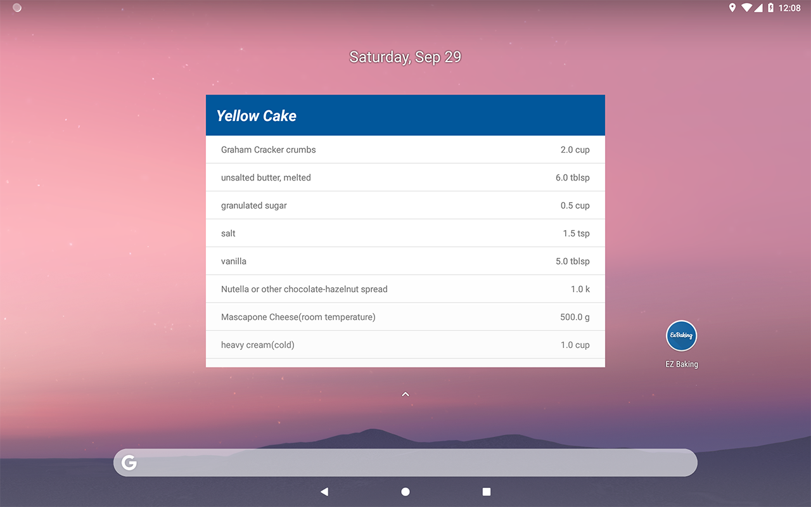

# Android Nanodegree
A repository of all the projects built from **scratch** for the **Grow with Google Android Developer Nanodegree Scholarship Program**

## Part 3
### Project 4: *Baking App*

**Task**: In this project, you will create an app to view video recipes. You will handle media loading, verify your user interfaces with UI tests, and integrate third party libraries. You'll also provide a complete user experience with a home screen widget.

#### Architecture
- [x] MVVM with Android Components
- [x] Repository Pattern with Room
- [x] Master/Detail flow to support responsive design (for phones and tablets)

#### Libraries
- [x] Android Support Libraries 
- [x] Retrofit
- [x] RxJava2
- [x] Butterknife
- [x] Timber
- [x] Picasso
- [x] Exoplayer
- [x] Espresso

#### Features
- [x] companion home screen widget 
- [x] fullscreen mode enabled for video in landscape view (phone only)

#### Designs
*phone:*

*tablet:*

## Part 2
### Project 2: *Popular Movies, Stage 1*

### Project 3: *Popular Movies, Stage 2*
